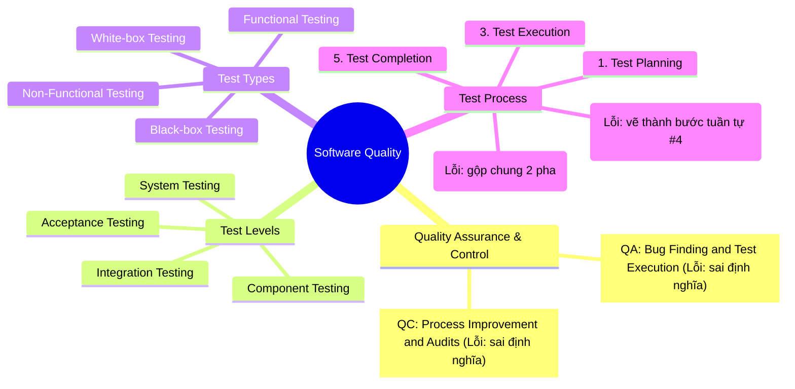
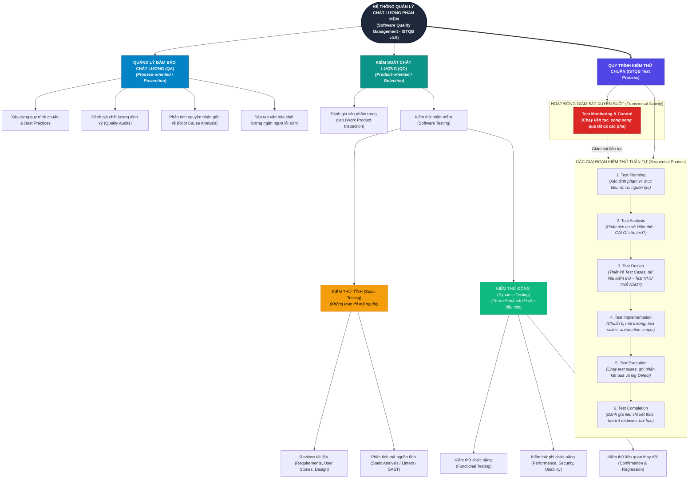

# QA/QC Role & ISTQB Test Process Mindmap (CLO G9.1)

**Exercise:** HW01 – Requirement 1 (CLO G9.1)  
**Standard Referenced:** ISTQB Certified Tester Foundation Level (CTFL) Syllabus v4.0  

---

## 1. Initial AI-Generated Mindmap (Raw AI Mindmap)
Sơ đồ thô do AI sinh ra chứa 3 sai sót trọng yếu về lý thuyết kiểm thử phần mềm:

---

## 2. Phân tích chi tiết 3 lỗi sai của AI (đối chiếu ISTQB CTFL v4.0)

### Lỗi 1: Đảo ngược hoàn toàn định nghĩa cốt lõi giữa QA và QC
- **Sai sót của AI:** AI gán *"Tìm lỗi và thực thi kiểm thử"* cho **QA**, và gán *"Cải tiến quy trình và đánh giá chất lượng"* cho **QC**.
- **Cơ sở chuẩn mực ISTQB CTFL v4.0 (Mục 1.2.2):**
  - **QA (Quality Assurance)** là hoạt động mang tính **phòng ngừa và định hướng quy trình (process-oriented)**, tập trung vào việc thiết lập và cải tiến các quy trình phát triển nhằm ngăn ngừa lỗi phát sinh ngay từ đầu.
  - **QC (Quality Control)** là hoạt động mang tính **sửa sai và định hướng sản phẩm (product-oriented)**, bao gồm việc thực thi kiểm thử phần mềm để phát hiện lỗi cụ thể trong sản phẩm.
- **Tác động:** Làm sai lệch hoàn toàn vai trò và trách nhiệm trong tổ chức kỹ thuật.

### Lỗi 2: Bỏ sót hoàn toàn Kiểm thử tĩnh (Static Testing)
- **Sai sót của AI:** AI chỉ liệt kê các khái niệm kiểm thử động, hoàn toàn bỏ qua nhánh **Static Testing**, đồng thời gộp lẫn lộn giữa *Kỹ thuật kiểm thử (Black-box / White-box)* và *Loại kiểm thử (Functional / Non-functional)*.
- **Cơ sở chuẩn mực ISTQB CTFL v4.0 (Chương 3):**
  - Kiểm thử bao gồm hai trụ cột song hành: **Static Testing** (rà soát yêu cầu, thiết kế và phân tích tĩnh mã nguồn mà không cần chạy code) và **Dynamic Testing** (thực thi mã với dữ liệu đầu vào). Bỏ qua Static Testing làm mất đi phương pháp ngăn chặn lỗi sớm và tiết kiệm chi phí nhất.

### Lỗi 3: Vẽ Test Monitoring & Control thành bước tuần tự thứ 4
- **Sai sót của AI:** AI xếp *"Test Monitoring & Control"* thành bước thứ 4 (nằm sau Test Execution và trước Test Completion); đồng thời gộp chung *Test Analysis & Design* và bỏ quên pha *Test Implementation*.
- **Cơ sở chuẩn mực ISTQB CTFL v4.0 (Mục 1.4.1 & 1.4.2):**
  - **Test Monitoring and Control** là hoạt động **quản trị xuyên suốt (transversal governance)**, diễn ra liên tục song song trong tất cả các giai đoạn kiểm thử.
  - Quy trình kiểm thử chuẩn gồm các giai đoạn phân định rõ: *Test Planning, Test Analysis (phân tích CÁI GÌ cần test), Test Design (thiết kế test case NHƯ THẾ NÀO), Test Implementation (chuẩn bị dữ liệu/môi trường/kịch bản tự động), Test Execution, và Test Completion*.

---

## 3. Sơ đồ chuẩn hóa toàn diện theo ISTQB CTFL v4.0

