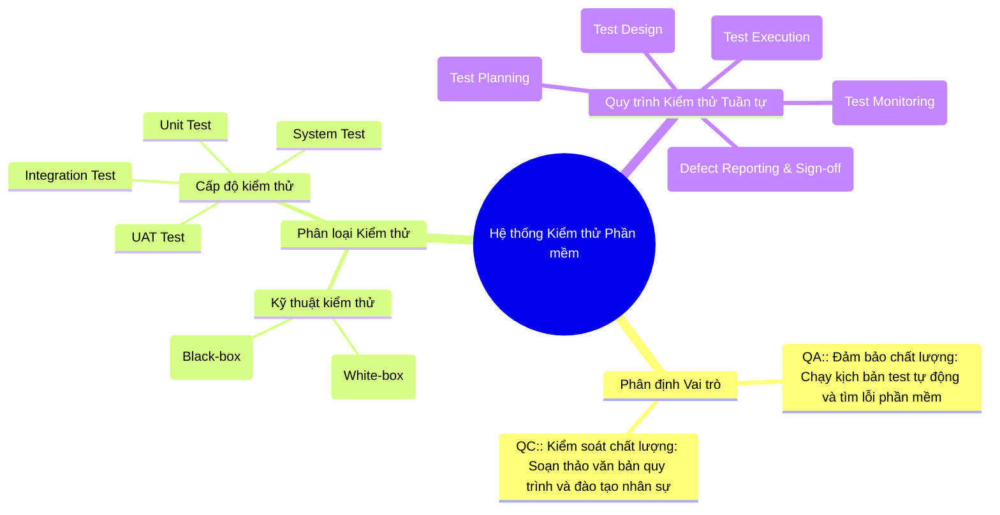
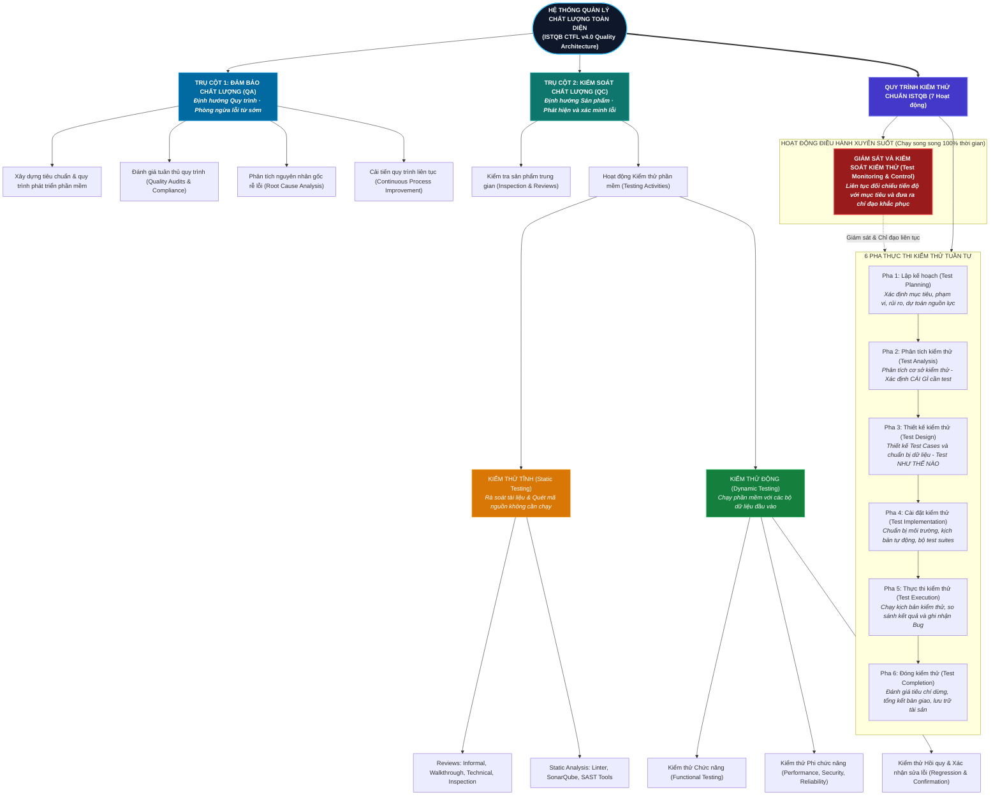

# Báo cáo Sơ đồ tư duy Quy trình ISTQB & Hoạt động CLO G9.1

**Bài tập:** HW01 – Yêu cầu 1 (Chuẩn đánh giá CLO G9.1)  
**Tiêu chuẩn đối chiếu:** ISTQB Certified Tester Foundation Level (CTFL) Syllabus v4.0  

---

## 1. Ngữ cảnh & Câu lệnh gửi cho AI (Prompt Sent to AI Tool)

Để thực hiện chuẩn đầu ra **CLO G9.1** (*Yêu cầu AI vẽ sơ đồ tư duy về quy trình kiểm thử chuẩn ISTQB và chỉ ra 3 lỗi sai*), tôi đã gửi câu lệnh sau đến công cụ AI (Gemini / ChatGPT):

> **Prompt:**  
> *"Đóng vai trò là một chuyên gia kiểm thử phần mềm, hãy vẽ một sơ đồ tư duy (mindmap) bằng cú pháp Mermaid mô tả chi tiết: (1) Sự khác biệt giữa vai trò của QA và QC trong dự án, (2) Các cấp độ và loại kiểm thử chính, và (3) Toàn bộ các bước tuần tự trong quy trình kiểm thử phần mềm chuẩn theo giáo trình ISTQB mới nhất."*

---

## 2. Kết quả thô do AI tạo ra (Raw AI-Generated Mindmap)

Dưới đây là sơ đồ thô nguyên bản do mô hình AI sinh ra:

---

## 3. Phân tích phản biện: 3 sai sót trọng yếu của AI đối chiếu theo ISTQB CTFL v4.0

Khi đối chiếu sơ đồ trên với tài liệu chuẩn quốc tế **ISTQB CTFL phiên bản 4.0**, tôi phát hiện 3 lỗi sai/thiếu sót mang tính bản chất kỹ thuật:

### 💡 Lỗi 1: Đảo lộn hoàn toàn định nghĩa và trách nhiệm giữa QA và QC (Mục 1.2.2)
- **Sai sót của AI:** AI mô tả **QA** là *"Chạy kịch bản test tự động và tìm lỗi"* (tập trung vào sản phẩm), trong khi lại gán **QC** là *"Soạn thảo quy trình và đào tạo"* (tập trung vào quy trình).
- **Cơ sở lý thuyết chuẩn ISTQB v4.0:** 
  - **QA (Quality Assurance):** Hoạt động định hướng quy trình (**process-oriented**), mang tính chất **phòng ngừa (preventive)**. QA tập trung vào việc định nghĩa, đánh giá (audit) và cải tiến liên tục quy trình phát triển nhằm ngăn ngừa khuyết tật sinh ra ngay từ đầu.
  - **QC (Quality Control):** Hoạt động định hướng sản phẩm (**product-oriented**), mang tính chất **phát hiện (corrective/detective)**. QC sử dụng các kỹ thuật kiểm thử phần mềm để xác minh xem sản phẩm thực tế có thỏa mãn các yêu cầu đặc tả hay không.
- **Tác động thực tế:** Việc hiểu sai này gây nhầm lẫn nghiêm trọng trong việc phân công công việc tại các doanh nghiệp công nghệ, biến kỹ sư QA thành thợ chạy test thuần túy thay vì người quản trị chất lượng quy trình.

---

### 💡 Lỗi 2: Bỏ qua 2 giai đoạn cốt lõi: Phân tích kiểm thử (Test Analysis) và Cài đặt kiểm thử (Test Implementation) (Mục 1.4.2)
- **Sai sót của AI:** Trong quy trình kiểm thử, AI nhảy cóc thẳng từ *Lập kế hoạch (Test Planning)* sang *Thiết kế kịch bản (Test Design)*, rồi từ Test Design chuyển ngay sang *Thực thi (Test Execution)*.
- **Cơ sở lý thuyết chuẩn ISTQB v4.0:** Một quy trình kiểm thử chuẩn mực bắt buộc phải trải qua:
  1. **Test Analysis (Phân tích kiểm thử):** Phân tích cơ sở kiểm thử (Test Basis: User Stories, tài liệu kiến trúc) để xác định **"CÁI GÌ CẦN ĐƯỢC KIỂM THỬ"** (xác định Test Conditions).
  2. **Test Implementation (Cài đặt kiểm thử):** Chuẩn bị môi trường, sinh dữ liệu kiểm thử (Test Data), sắp xếp các quy trình test (Test Procedures) và viết mã tự động hóa (Automation Test Scripts) trước khi bắt đầu bấm chạy.
- **Tác động thực tế:** Bỏ qua Test Analysis dẫn đến tình trạng viết test case mù quáng không dựa trên phân tích rủi ro yêu cầu; bỏ qua Test Implementation khiến việc thực thi bị động, thiếu dữ liệu và môi trường không ổn định.

---

### 💡 Lỗi 3: Xếp hoạt động Giám sát kiểm thử (Test Monitoring) thành bước tuần tự cuối cùng số 5 (Mục 1.4.1)
- **Sai sót của AI:** AI đặt *"Bước 5: Giám sát kiểm thử (Test Monitoring)"* ở vị trí cuối cùng, nằm sau cả bước báo cáo và đóng dự án (Sign-off).
- **Cơ sở lý thuyết chuẩn ISTQB v4.0:** 
  - **Test Monitoring and Control** là một **hoạt động điều hành xuyên suốt (transversal/continuous activity)**. 
  - Hoạt động này phải diễn ra **song song và liên tục** từ ngày đầu tiên bắt đầu lập kế hoạch (Test Planning) cho đến khi kết thúc toàn bộ dự án (Test Completion), nhằm đo lường tiến độ thực tế so với kế hoạch và kịp thời đưa ra biện pháp điều chỉnh (Control).
- **Tác động thực tế:** Đợi đến khi bàn giao dự án mới đi "giám sát" là hoàn toàn vô nghĩa và phản khoa học trong quản lý kỹ thuật phần mềm.

---

## 4. Sơ đồ tư duy chuẩn hóa toàn diện theo ISTQB CTFL v4.0

Dưới đây là sơ đồ được tái cấu trúc chính xác, biểu diễn mối quan hệ tương hỗ giữa QA, QC và các giai đoạn kiểm thử theo đúng chuẩn quốc tế:

