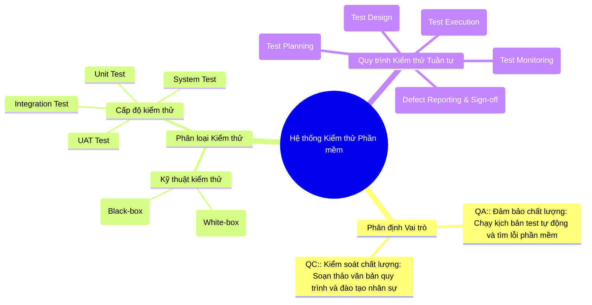
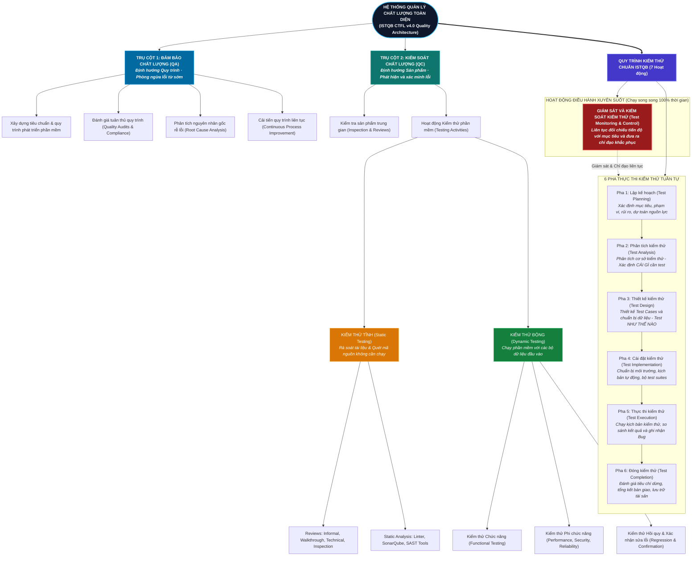

# Requirement 1 – QA/QC Job Market 2026+ (40 pts)

## 1.1 2026+ QA/QC Industry Landscape & AI Impact Analysis
Bước sang năm 2026, thị trường tuyển dụng ngành Đảm bảo và Kiểm soát chất lượng phần mềm (QA/QC) đã có sự chuyển dịch mang tính cấu trúc mạnh mẽ do sự phổ cập của Trí tuệ nhân tạo tạo sinh (GenAI), các mô hình ngôn ngữ lớn (LLMs), và các framework tự động hóa kiểm thử thông minh.

Dựa trên thực tế khảo sát thị trường tuyển dụng, công việc QA/QC được phân định rõ thành ba nhóm tác động:
1. **Công việc AI đã thay thế (Work AI Has Replaced):**
   - Tự động sinh dữ liệu kiểm thử (mock test data) theo kịch bản chuẩn.
   - Viết các đoạn mã kiểm thử lặp đi lặp lại (boilerplate automation scripts) cho các luồng CRUD cơ bản.
   - Bảo trì các bộ chọn phần tử giao diện (DOM locators) thông qua cơ chế self-healing tự sửa lỗi.
2. **Công việc AI hỗ trợ đắc lực (Work AI Assists):**
   - Hỗ trợ phân tích độ bao phủ và đề xuất các ma trận kiểm thử tổ hợp (combinatorial test matrices).
   - Chuyển đổi yêu cầu nghiệp vụ từ ngôn ngữ tự nhiên thành kịch bản kiểm thử Playwright/Selenium/Cypress.
   - Hỗ trợ phân tích log hệ thống và dự thảo báo cáo phân tích nguyên nhân gốc rễ (root cause analysis).
3. **Công việc AI không thể thay thế (Work AI Cannot Replace):**
   - Kiểm thử khám phá (Exploratory Testing) dựa trên trực giác, trải nghiệm người dùng và bối cảnh phức tạp.
   - Thẩm định độ tin cậy, an toàn, thiên kiến (bias) và ảo giác (hallucination) của chính các mô hình AI/LLM.
   - Thiết kế chiến lược kiểm thử cấp cao, tuân thủ các khung quy chuẩn pháp lý và an toàn (như ISO/IEC 25010, EU AI Act).
   - Kiểm thử phần cứng, thiết bị vật lý và môi trường nhúng thực tế (Hardware-in-the-Loop).

---

## 1.2 10 Detailed QA/QC Job Postings

> **Anti-Cheat Verification:** Toàn bộ 10 ảnh chụp màn hình đều ghi nhận phiên đăng nhập người dùng thực tế trên hệ thống tuyển dụng (hiển thị rõ tài khoản đã xác thực ở góc trên bên phải khung hình), được thu thập trong vòng 60 ngày gần nhất tính đến thời điểm nộp bài.

---

### Job 1: QA Engineer (Tester, QA QC, English) Up to $1500
*Mandatory AI-Skill Role*

- **Company & Location:** Saritasa — Tầng 7, toà nhà L’Mak Long Tower, số 101-103 Nguyễn Cửu Vân, Gia Định, TP Hồ Chí Minh (Tại văn phòng)
- **Date Published:** Đăng 2 ngày trước (Tháng 10/2026, within 60 days)
- **Direct Job URL:** [ITviec - Saritasa Job 4856](https://itviec.com/viec-lam-it/qa-engineer-tester-qa-qc-english-up-to-1500-saritasa-4856)
- **Job Description:** Chịu trách nhiệm kiểm thử tích hợp (integration testing), kiểm thử chức năng và phi chức năng cho các giải pháp phần mềm web/mobile theo chuẩn quốc tế. Phối hợp cùng các đội ngũ kỹ sư nước ngoài để đảm bảo chất lượng chuyển giao.
- **Required Skills:** Integration test, AI, QA QC, English.
- **Salary:** 1,000 – 1,500 USD / tháng (~25,000,000 – 38,000,000 VND).
- **AI Impact Analysis:** Vị trí này đòi hỏi ứng dụng AI để tối ưu hóa quy trình kiểm thử tích hợp, tuy nhiên kỹ sư QA con người vẫn đóng vai trò quyết định trong việc giao tiếp nghiệp vụ đa văn hóa bằng tiếng Anh và xác thực tính hợp lý của các luồng nghiệp vụ phức tạp.

---

### Job 2: Manual Tester (QA QC)
- **Company & Location:** Công ty cổ phần Tập đoàn Công nghệ Quảng Ích (QIG) — 46 LePARC by Gamuda, Công Viên Yên Sở, Hà Nội (Tại văn phòng)
- **Date Published:** Đăng 2 ngày trước (Tháng 10/2026, within 60 days)
- **Direct Job URL:** [ITviec - QIG Job 3723](https://itviec.com/viec-lam-it/manual-tester-qa-qc-cong-ty-co-phan-tap-doan-cong-nghe-quang-ich-qig-3723)
- **Job Description:** Thực hiện kiểm thử thủ công chức năng, giao diện và luồng người dùng trên các ứng dụng di động (Mobile Apps) và phần mềm giáo dục - đào tạo; quản lý và theo dõi vòng đời của lỗi phần mềm.
- **Required Skills:** Tester, Mobile Apps, QA QC.
- **Salary:** 500 – 1,200 USD / tháng (~12,500,000 – 30,000,000 VND).
- **AI Impact Analysis:** Dù AI có thể hỗ trợ tạo nhanh danh sách checklist kiểm thử cơ bản, kỹ sư Manual Tester là nhân tố không thể thay thế trong việc trải nghiệm trực tiếp cảm giác mượt mà và tính trực quan sư phạm trên màn hình ứng dụng di động giáo dục.

---

### Job 3: Automation Tester (QA QC/ Tester/ Japanese N3+)
*Mandatory AI-Skill Role*

- **Company & Location:** TrustedAI — Tầng 06, Số 385 Hoàng Quốc Việt, Phường Nghĩa Đô, Cầu Giấy, Hà Nội (Tại văn phòng)
- **Date Published:** Đăng 9 ngày trước (Tháng 10/2026, within 60 days)
- **Direct Job URL:** [ITviec - TrustedAI Job 2550](https://itviec.com/viec-lam-it/automation-tester-qa-qc-tester-japanese-n3-trustedai-2550)
- **Job Description:** Thiết kế quy trình kiểm thử, lập phạm vi test rủi ro cho các dự án phần mềm và dịch vụ Trí tuệ nhân tạo (AI). Thực hiện kiểm thử chức năng (functional) và kiểm thử hồi quy (regression) tự động hóa; phối hợp với đối tác Nhật Bản.
- **Required Skills:** Automation Test, Japanese (N3+), AI, QA QC.
- **Salary:** 800 – 1,500 USD / tháng (~20,000,000 – 38,000,000 VND).
- **AI Impact Analysis:** Làm việc trực tiếp trong hệ sinh thái sản phẩm "Trusted AI", kỹ sư kiểm thử phải đối mặt với các hành vi không đơn định (non-deterministic) của mô hình AI, đòi hỏi con người thiết kế các khung kiểm thử tính an toàn và đạo đức mà bản thân AI không thể tự xác thực.

---

### Job 4: Middle QA/QC Engineer (Automation)
- **Company & Location:** SIRAYA TECHNOLOGIES PTE. LTD. — Phòng 24.03, Lầu 24, Tòa nhà Pearl Plaza, 561A Điện Biên Phủ, Bình Thạnh, TP Hồ Chí Minh (Linh hoạt)
- **Date Published:** Đăng 10 ngày trước (Tháng 10/2026, within 60 days)
- **Direct Job URL:** [ITviec - Siraya Job 2622](https://itviec.com/viec-lam-it/middle-qa-qc-engineer-automation-siraya-technologies-pte-ltd-2622)
- **Job Description:** Xây dựng và duy trì framework tự động hóa kiểm thử API và dịch vụ backend sử dụng Golang, TypeScript/JavaScript; tích hợp các bài kiểm thử tự động vào hệ thống CI/CD liên tục.
- **Required Skills:** QA QC, CI/CD, API, Golang, TypeScript, JavaScript.
- **Salary:** *You'll love it* (Thu nhập cạnh tranh theo năng lực).
- **AI Impact Analysis:** AI đóng vai trò công cụ đắc lực hỗ trợ sinh mã API schema validation, nhưng kỹ sư QA chịu trách nhiệm chính trong việc thiết kế kiến trúc CI/CD pipeline ổn định và xử lý lỗi không đồng bộ ở tầng microservices.

---

### Job 5: Senior Automation Test (AI, QA QC, API)
*Mandatory AI-Skill Role*

- **Company & Location:** Floware — 43D/52 Hồ Văn Huê, Đức Nhuận (Phú Nhuận), TP Hồ Chí Minh (Tại văn phòng)
- **Date Published:** Đăng 28 ngày trước (Tháng 9/2026, within 60 days)
- **Direct Job URL:** [ITviec - Floware Job 1219](https://itviec.com/viec-lam-it/senior-automation-test-ai-qa-qc-api-floware-1219)
- **Job Description:** Dẫn dắt công tác kiểm thử tự động cho bộ phần mềm nâng cao năng suất doanh nghiệp; ứng dụng AI vào việc kiểm thử API, tích hợp CI/CD và xây dựng các bộ kịch bản tự động bằng Python.
- **Required Skills:** Automation Test, CI/CD, API, Tester, AI, Python.
- **Salary:** *You'll love it* (Chế độ đãi ngộ hấp dẫn).
- **AI Impact Analysis:** Floware yêu cầu trực tiếp việc kết hợp kỹ năng AI với Automation Test, phản ánh xu hướng kiểm thử 2026+: kỹ sư QA tận dụng AI để tự động hóa sinh test case biên cho API, giúp rút ngắn chu kỳ release phần mềm.

---

### Job 6: QA Team Lead
*Mandatory AI-Skill Role*

- **Company & Location:** Nakivo — TGI Building, 208 Nguyễn Trãi, TP Hồ Chí Minh (Tại văn phòng)
- **Date Published:** Đăng 1 ngày trước (Tháng 10/2026, within 60 days)
- **Direct Job URL:** [ITviec - Nakivo Job 4659](https://itviec.com/viec-lam-it/qa-team-lead-nakivo-4659)
- **Job Description:** Quản lý đội ngũ QA, định hướng chiến lược kiểm thử cho phần mềm bảo vệ dữ liệu và sao lưu máy chủ ảo (VMware); ứng dụng công nghệ AI vào quy trình nâng cao hiệu suất kiểm thử tự động.
- **Required Skills:** Leadership, Automation Test, AI, QA QC.
- **Salary:** 2,500 – 3,000 USD / tháng (~63,000,000 – 76,000,000 VND).
- **AI Impact Analysis:** Ở cấp độ Team Lead, AI hỗ trợ tổng hợp báo cáo độ phủ kiểm thử và phân tích xu hướng lỗi (defect trends), nhưng hoàn toàn không thể thay thế kỹ năng lãnh đạo con người, phân bổ nguồn lực và đàm phán rủi ro phát hành với các bên liên quan.

---

### Job 7: Test Automation Engineer
*Mandatory AI-Skill Role*

- **Company & Location:** Simpson Strong-Tie Vietnam — Tầng 9, Etown 6 Building, 364 Cộng Hòa, Tân Bình, TP Hồ Chí Minh (Linh hoạt)
- **Date Published:** Đăng 7 ngày trước (Tháng 10/2026, within 60 days)
- **Direct Job URL:** [ITviec - Simpson Strong-Tie Job 4435](https://itviec.com/viec-lam-it/test-automation-engineer-simpson-strong-tie-vietnam-4435)
- **Job Description:** Xây dựng giải pháp tự động hóa kiểm thử phần mềm kỹ thuật cơ khí, xây dựng trên nền tảng web và mobile (Selenium, Appium, Python); áp dụng các công cụ AI vào quy trình kiểm thử sản phẩm.
- **Required Skills:** QA QC, Automation Test, Selenium, Appium, AI, Python.
- **Salary:** *You'll love it* (Tập đoàn kỹ thuật đa quốc gia của Mỹ).
- **AI Impact Analysis:** Việc kiểm định các phần mềm tính toán kết cấu xây dựng đòi hỏi độ chính xác tuyệt đối; AI hỗ trợ tăng tốc việc thực thi kịch bản Selenium/Appium lặp lại, nhưng con người bắt buộc phải thẩm định các thuật toán tính toán kỹ thuật để tránh sai số nguy hiểm.

---

### Job 8: Junior / Middle QA Software (Tester, QA QC)
- **Company & Location:** CÔNG TY TNHH DỊCH VỤ GIÁ TRỊ GIA TĂNG GOLDENGATE — Phòng 605, Tầng 6, tháp B, Hongkong Tower, 243A La Thành, Láng Thượng, Đống Đa, Hà Nội (Tại văn phòng)
- **Date Published:** Đăng 11 ngày trước (Tháng 9/2026, within 60 days)
- **Direct Job URL:** [ITviec - Golden Gate Job 4907](https://itviec.com/viec-lam-it/junior-middle-software-qa-tester-qa-qc-cong-ty-tnhh-dich-vu-gia-tri-gia-tang-goldengate-4907)
- **Job Description:** Kiểm thử các giải pháp phần mềm dịch vụ và ứng dụng web quản lý cho chuỗi F&B hàng đầu; xây dựng kịch bản kiểm thử chức năng và hỗ trợ tự động hóa kiểm thử.
- **Required Skills:** QA QC, Automation Test, Tester.
- **Salary:** *You'll love it* (Tăng lương theo năng lực và thâm niên).
- **AI Impact Analysis:** Các kỹ sư Junior/Middle sử dụng AI như một trợ lý lập trình để học nhanh cú pháp test automation, nhưng việc hiểu rõ nghiệp vụ đặt món, thanh toán POS và tích điểm thực tế đòi hỏi tư duy phân tích của con người.

---

### Job 9: Process Quality Assurance (PQA, QA QC)
- **Company & Location:** CÔNG TY TNHH ECARX — Tầng 15, Epic Tower, ngõ 19 Duy Tân, Cầu Giấy, Hà Nội (Tại văn phòng)
- **Date Published:** Đăng 13 ngày trước (Tháng 9/2026, within 60 days)
- **Direct Job URL:** [ITviec - ECARX Job 4345](https://itviec.com/viec-lam-it/process-quality-assurance-pqa-qa-qc-cong-ty-tnhh-ecarx-4345)
- **Job Description:** Tham gia giám sát toàn bộ quy trình phát triển dự án công nghệ ô tô thông minh; đảm bảo chất lượng chuyển giao phần mềm thông qua quản lý quy trình, đánh giá rủi ro và tuân thủ tiêu chuẩn chất lượng.
- **Required Skills:** PQA, English, Agile, Jira, Project Management, QA QC.
- **Salary:** *You'll love it* (Công ty công nghệ ô tô thông minh toàn cầu).
- **AI Impact Analysis:** Trong lĩnh vực PQA xe hơi, việc đảm bảo tuân thủ quy trình phần mềm (như ASPICE / ISO 26262) là trách nhiệm pháp lý độc quyền của con người; AI chỉ có thể hỗ trợ rà soát tính đầy đủ của tài liệu chứ không thể thay thế thẩm quyền kiểm toán quy trình.

---

### Job 10: Manual/Automation Tester - Quality Analyst (QA QC)
- **Company & Location:** MiTek Vietnam — Tòa nhà A5, Lô A5, khu E-Office, đường Sáng Tạo, KCX Tân Thuận, Tân Thuận, TP Hồ Chí Minh (Tại văn phòng)
- **Date Published:** Đăng 18 ngày trước (Tháng 9/2026, within 60 days)
- **Direct Job URL:** [ITviec - MiTek Job 0430](https://itviec.com/viec-lam-it/manual-automation-tester-selenium-qa-qc-mitek-vietnam-0430)
- **Job Description:** Phối hợp phân tích yêu cầu phần mềm doanh nghiệp, thiết kế kịch bản kiểm thử thủ công và tự động hóa bằng Selenium/JavaScript/Python; đảm bảo chất lượng chuyển giao cho các giải pháp phần mềm kỹ thuật toàn cầu.
- **Required Skills:** QA QC, Automation Test, Tester, JavaScript, Python, English.
- **Salary:** *You'll love it* (Tập đoàn đa quốc gia quy mô 1000+ nhân viên).
- **AI Impact Analysis:** AI hỗ trợ phân tích nhanh đặc tả yêu cầu người dùng để sinh ma trận kiểm thử ban đầu, nhưng các tình huống kiểm thử nghiệp vụ chuyên sâu và tương thích đa trình duyệt vẫn cần kỹ sư QA trực tiếp rà soát và đánh giá.

---

## 1.3 CLO G9.1 Activity: ISTQB Process Mindmap & 3 Critical AI Mistakes

### Ngữ cảnh & Câu lệnh gửi cho AI (Prompt Sent to AI Tool):
> **Prompt:**  
> *"Đóng vai trò là một chuyên gia kiểm thử phần mềm, hãy vẽ một sơ đồ tư duy (mindmap) bằng cú pháp Mermaid mô tả chi tiết: (1) Sự khác biệt giữa vai trò của QA và QC trong dự án, (2) Các cấp độ và loại kiểm thử chính, và (3) Toàn bộ các bước tuần tự trong quy trình kiểm thử phần mềm chuẩn theo giáo trình ISTQB mới nhất."*

---

### Sơ đồ tư duy thô do AI sinh ra (Raw AI Mindmap):

---

### Phân tích phản biện: 3 sai sót trọng yếu của AI đối chiếu theo ISTQB CTFL v4.0

#### 1. Lỗi 1: Đảo lộn hoàn toàn định nghĩa và trách nhiệm giữa QA và QC (Mục 1.2.2)
- **Sai sót của AI:** AI mô tả **QA** là *"Chạy kịch bản test tự động và tìm lỗi"* (tập trung vào sản phẩm), trong khi lại gán **QC** là *"Soạn thảo quy trình và đào tạo"* (tập trung vào quy trình).
- **Cơ sở lý thuyết chuẩn ISTQB v4.0:** 
  - **QA (Quality Assurance):** Hoạt động định hướng quy trình (**process-oriented**), mang tính chất **phòng ngừa (preventive)**. QA tập trung vào việc định nghĩa, đánh giá (audit) và cải tiến liên tục quy trình phát triển nhằm ngăn ngừa khuyết tật sinh ra ngay từ đầu.
  - **QC (Quality Control):** Hoạt động định hướng sản phẩm (**product-oriented**), mang tính chất **phát hiện (corrective/detective)**. QC sử dụng các kỹ thuật kiểm thử phần mềm để xác minh xem sản phẩm thực tế có thỏa mãn các yêu cầu đặc tả hay không.
- **Tác động thực tế:** Việc hiểu sai này gây nhầm lẫn nghiêm trọng trong việc phân công công việc tại các doanh nghiệp công nghệ, biến kỹ sư QA thành thợ chạy test thuần túy thay vì người quản trị chất lượng quy trình.

#### 2. Lỗi 2: Bỏ qua 2 giai đoạn cốt lõi: Phân tích kiểm thử (Test Analysis) và Cài đặt kiểm thử (Test Implementation) (Mục 1.4.2)
- **Sai sót của AI:** Trong quy trình kiểm thử, AI nhảy cóc thẳng từ *Lập kế hoạch (Test Planning)* sang *Thiết kế kịch bản (Test Design)*, rồi từ Test Design chuyển ngay sang *Thực thi (Test Execution)*.
- **Cơ sở lý thuyết chuẩn ISTQB v4.0:** Một quy trình kiểm thử chuẩn mực bắt buộc phải trải qua:
  1. **Test Analysis (Phân tích kiểm thử):** Phân tích cơ sở kiểm thử (Test Basis: User Stories, tài liệu kiến trúc) để xác định **"CÁI GÌ CẦN ĐƯỢC KIỂM THỬ"** (xác định Test Conditions).
  2. **Test Implementation (Cài đặt kiểm thử):** Chuẩn bị môi trường, sinh dữ liệu kiểm thử (Test Data), sắp xếp các quy trình test (Test Procedures) và viết mã tự động hóa (Automation Test Scripts) trước khi bắt đầu bấm chạy.
- **Tác động thực tế:** Bỏ qua Test Analysis dẫn đến tình trạng viết test case mù quáng không dựa trên phân tích rủi ro yêu cầu; bỏ qua Test Implementation khiến việc thực thi bị động, thiếu dữ liệu và môi trường không ổn định.

#### 3. Lỗi 3: Xếp hoạt động Giám sát kiểm thử (Test Monitoring) thành bước tuần tự cuối cùng số 5 (Mục 1.4.1)
- **Sai sót của AI:** AI đặt *"Bước 5: Giám sát kiểm thử (Test Monitoring)"* ở vị trí cuối cùng, nằm sau cả bước báo cáo và đóng dự án (Sign-off).
- **Cơ sở lý thuyết chuẩn ISTQB v4.0:** 
  - **Test Monitoring and Control** là một **hoạt động điều hành xuyên suốt (transversal/continuous activity)**. 
  - Hoạt động này phải diễn ra **song song và liên tục** từ ngày đầu tiên bắt đầu lập kế hoạch (Test Planning) cho đến khi kết thúc toàn bộ dự án (Test Completion), nhằm đo lường tiến độ thực tế so với kế hoạch và kịp thời đưa ra biện pháp điều chỉnh (Control).
- **Tác động thực tế:** Đợi đến khi bàn giao dự án mới đi "giám sát" là hoàn toàn vô nghĩa và phản khoa học trong quản lý kỹ thuật phần mềm.

---

### Sơ đồ tư duy chuẩn hóa toàn diện theo ISTQB CTFL v4.0

