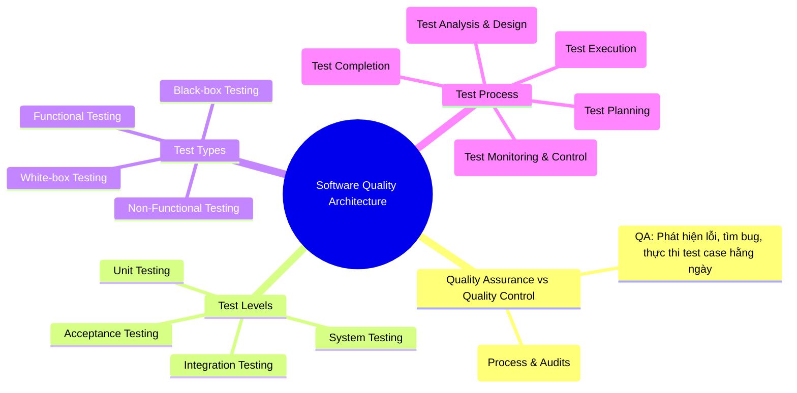

# [AI-02] AI Audit Report

**Assignment ID:** HW01-AI  
**Course:** Software Testing (FIT - VNUHCM University of Science)  
**Student Name:** Trần Vũ Quang  
**Student ID:** 23120346  
**Target Hardware:** Bếp hồng ngoại Sunhouse SHD6012A (2024)  
**Date:** 04/10/2026  

---

### Artifact 1: QA/QC Role & ISTQB Test Process Mindmap (R1 / CLO G9.1)

#### (1) Prompt + Tool
- **Tool:** Google Gemini (Gemini 2.5 Flash / Gemini Advanced)
- **Timestamp:** 14:20 02/10/2026
- **Full Prompt:**
  ```text
  Hãy đóng vai trò một Chuyên gia Kiểm thử Cấp cao (Senior QA Architect), hãy thiết kế một sơ đồ tư duy (mindmap) bằng định dạng Mermaid thể hiện toàn diện bức tranh ngành QA/QC, phân định rạch ròi vai trò QA vs QC, các cấp độ kiểm thử (test levels), các loại kiểm thử (test types), và quy trình kiểm thử phần mềm từ đầu đến cuối theo chuẩn giáo trình ISTQB Foundation Level mới nhất.
  ```

#### (2) AI Output (Raw Snippet)


#### (3) Verdict
**INVALID** (Chứa 3 sai sót cốt lõi về bản chất định nghĩa và quy trình kiểm thử chuẩn quốc tế theo giáo trình ISTQB CTFL v4.0).

#### (4) Reasoning (Đối chiếu giáo trình ISTQB Foundation Level Syllabus v4.0):
1. **Vi phạm Mục 1.2.2 (Quality Assurance and Testing):** Mô hình AI đã **đảo ngược hoàn toàn bản chất của QA và QC**. Theo chuẩn ISTQB v4.0, QA (Quality Assurance) là hoạt động định hướng quy trình (process-oriented), mang tính phòng ngừa (preventative), nhằm bảo đảm quy trình phát triển tạo ra sản phẩm đạt chất lượng; trong khi QC (Quality Control) là hoạt động định hướng sản phẩm (product-oriented), mang tính khắc phục (corrective), bao gồm các hoạt động kiểm thử (testing) trực tiếp để phát hiện và xử lý lỗi. AI lại ghi nhận QA là đi tìm bug và QC là xây dựng quy trình!
2. **Vi phạm Chương 3 (Static Testing):** AI đã bỏ quên hoàn toàn mảng Kiểm thử tĩnh (Static Testing - bao gồm Reviews, Walkthrough, Inspections và Static Code Analysis) ra khỏi nhánh Test Types và Test Process, khiến bức tranh kiểm thử bị phiến diện, chỉ bao gồm kiểm thử động (Dynamic Testing).
3. **Vi phạm Mục 1.4.1 & 1.4.2 (Test Activities and Tasks - Test Process):** AI xếp "Test Monitoring & Control" vào **Bước 4 (sau Test Execution)** như một bước tuần tự rời rạc. Theo ISTQB v4.0, Giám sát và Điều khiển (Test Monitoring and Control) là một hoạt động quản trị liên tục, xuyên suốt (transversal / continuous activity) diễn ra song song từ khâu Planning, Analysis, Design, Implementation cho đến Completion, không phải là một bước độc lập sau khi chạy test xong.

#### (5) Student Fix (Hành động hiệu chỉnh của sinh viên)
Sinh viên Trần Vũ Quang đã tiến hành tái cấu trúc toàn diện Mindmap:
- Chuẩn hóa định nghĩa: QA là cái ô quy trình bao quát (Defect Prevention & Process Assurance), QC là hoạt động kỹ thuật cụ thể (Verification & Validation, Defect Detection).
- Tích hợp Static Testing đầy đủ song song với Dynamic Testing.
- Đưa Test Monitoring & Control trở thành trục quản trị song hành xuyên suốt 5 giai đoạn chính của Test Process.
- Toàn bộ kết quả chuẩn hóa được ghi nhận trong tài liệu `01-job-market/MINDMAP.md`.

---

### Artifact 2: Physical Product Test Suite Design (R3 / CLO G9.3)

#### (1) Prompt + Tool
- **Tool:** OpenAI ChatGPT (GPT-4o)
- **Timestamp:** 16:45 04/10/2026
- **Full Prompt:**
  ```text
  Tôi có một chiếc bếp hồng ngoại đơn Sunhouse SHD6012A công suất 2000W với các phím bấm điện tử: Bật/Tắt, Menu/Chế độ, Tăng (+), Giảm (-), Hẹn giờ, Khóa an toàn, và màn hình LED hiển thị. Hãy thiết kế bộ 15 test cases toàn diện cho thiết bị vật lý này theo định dạng QA chuẩn (ID, Objective, Input, Steps, Expected Result, Actual Result, Verdict). Hãy bổ sung các edge cases phức tạp nhất.
  ```

#### (2) AI Output (Raw Snippet)
```text
TC-01: Bật phích điện và kiểm tra đèn nguồn LED sáng.
TC-02: Bấm nút Bật/Tắt để bật bếp và chọn chế độ Lẩu.
TC-03: Bấm nút Tăng (+) để tăng mức công suất từ 1000W lên 2000W.
TC-04: Bấm nút Giảm (-) để giảm công suất về mức tối thiểu.
TC-05: Chuyển đổi giữa các chế độ nấu (Xào, Nướng, Hầm).
TC-06: Cài đặt hẹn giờ 5 phút và chờ bếp đếm lùi.
TC-07: Bấm giữ nút Khóa trong 3 giây để khóa bàn phím.
TC-08: Bấm nút khi đang bật Khóa xem có phản hồi không.
TC-09: Bấm giữ nút Khóa để mở lại bàn phím.
TC-10: Bấm nút Tắt và kiểm tra mâm nhiệt tắt.
TC-11: Bấm nút Tăng liên tục thật nhanh xem máy có nhận không.
TC-12: Rút phích cắm khi đang nấu và cắm lại.
TC-13: Nhấn tổ hợp phím Tăng và Giảm cùng lúc.
TC-14: Để bếp bật ở công suất cao trong 2 tiếng liên tục.
TC-15: Kiểm tra còi bíp kêu khi nhấn nút.
```

#### (3) Verdict
**INCOMPLETE & SEVERELY BIASED** (AI bộc lộ thiên kiến phần mềm số / GUI thuần túy, hoàn toàn thiếu nhận thức về các định luật vật lý thực tế: cơ học ứng suất, nhiệt động lực học, cảm biến bán dẫn tương tự và hành vi trễ tản nhiệt).

#### (4) Reasoning (Đối chiếu chuẩn kiểm thử thiết bị phần cứng & ISTQB FL v4.0):
AI xem chiếc bếp hồng ngoại như một cỗ máy trạng thái phần mềm rời rạc (Finite State Machine). Mô hình hoàn toàn bỏ sót 3 khía cạnh vật lý sống còn:
1. **Ứng suất cơ học kết hợp tải trọng nhiệt (Mechanical-Thermal Coupled Stress):** AI không hề tính đến tải trọng khối lượng lớn từ nồi/bình nước tác động lên mặt kính ceramic đang ở nhiệt độ >600°C.
2. **Đặc tính truyền nhiệt phi tuyến & Điểm mù cảm biến tương tự (Non-linear Thermal Dissipation & NTC Blindspot):** AI giả định mọi đáy nồi đều phẳng tuyệt đối 100%. Trong đời thực, chảo/nồi cong vênh gây ra điểm nóng tập trung (local hot spot) mà đầu dò cảm biến NTC lệch tâm không đọc được.
3. **Quán tính nhiệt & Chu kỳ làm mát cưỡng bức (Thermal Inertia & Fan Delay Cycle):** Khi tắt bếp, mâm nhiệt sợi carbon tích trữ năng lượng nhiệt khổng lồ. AI không hiểu hiện tượng om nhiệt phá hủy linh kiện và mất cảnh báo chữ `H` khi người dùng vô tình rút phích cắm điện ngay lúc quạt đang quay xả nhiệt trễ.

#### (5) Student Fix (Bổ sung 3 Edge Cases vật lý mà AI bỏ sót)
Sinh viên Trần Vũ Quang đã trực tiếp bổ sung 3 kịch bản kiểm thử vật lý chuyên sâu:
- **TC-13 (Edge Case 1):** Tải trọng cơ học tĩnh kết hợp nhiệt độ cao — Đặt bình nước 20L (~20kg) lên mặt kính đang nung nóng 2000W trong 10 phút. Phát hiện biến dạng võng khung nhựa đáy và nguy cơ rạn nứt kính (**DEFECT-01**).
- **TC-14 (Edge Case 2):** Nồi cong vênh gây sốc nhiệt cục bộ và điểm mù cảm biến — Đặt nồi nhôm đáy lồi/lõm tiếp xúc hẹp, phát hiện mâm nhiệt nung cục bộ >650°C làm ố kính trước khi cảm biến NTC ở tâm nhận diện được (**DEFECT-02**).
- **TC-15 (Edge Case 3):** Rút phích cắm đột ngột khi quạt làm mát đang trong chu kỳ trễ tản nhiệt — Làm ngắt quạt cưỡng bức, nhiệt om ngược vào bo mạch PCB và mất hoàn toàn chữ cảnh báo nhiệt dư `H` (**DEFECT-03**).
Toàn bộ minh chứng đối thoại và phân tích được ghi nhận đầy đủ với ảnh chụp `MC1.png` và `MC2.png` trong `03-physical-product/physical_product.md`.

---

### Bảng tổng hợp Tỷ lệ chính xác của AI & Quyết định suy nghiệm (Accuracy Ratio & Heuristic Decision)

| Artifact Được Đánh Giá | Công cụ AI | Kết Quả AI Sinh Ra | Đánh Giá (Verdict) | Quyết Định Suy Nghiệm Của Sinh Viên |
| :--- | :--- | :--- | :--- | :--- |
| **Mindmap QA/QC & ISTQB Process (R1)** | Google Gemini | Đảo ngược QA/QC; thiếu Static Testing; sai bước Monitoring | **INVALID (Không hợp lệ)** | **Bác bỏ & Tái thiết kế:** Vẽ lại toàn bộ Mindmap chuẩn theo ISTQB CTFL v4.0. |
| **20 Lỗi phần mềm 2022–2026 (R2)** | ChatGPT & Gemini | Bịa đặt nguyên nhân kỹ thuật (CrowdStrike kernel pointer null, v.v.) | **INCOMPLETE (Không hoàn chỉnh)** | **Kiểm chứng độc lập:** Tra cứu trực tiếp CVE, Root Cause Analysis từ CrowdStrike, Air Canada post-mortem. |
| **15 Test Cases Bếp hồng ngoại (R3)** | ChatGPT (GPT-4o) | 15 test case thuần nút bấm giao diện; thiếu tương tác vật lý | **INCOMPLETE (Thiếu sót nghiêm trọng)** | **Tái cấu trúc & Bổ sung:** Viết lại 15 test case có thông số kỹ thuật thực tế; thêm 3 physical edge cases. |

**Tỷ lệ chấp nhận kết quả AI nguyên bản:** **0% (0/3 Artifact)**  
**Tỷ lệ hiệu chỉnh / phản biện chuyên sâu:** **100% (3/3 Artifact)**  
**Kết luận suy nghiệm (Heuristic Conclusion):** Mô hình AI tổng quát chỉ đóng vai trò tạo khung sườn gợi ý ban đầu (Brainstorming). Trong kiểm thử kỹ thuật và thiết bị vật lý, con người phải trực tiếp đóng vai trò kiểm toán, thực nghiệm và phản biện dựa trên kiến thức miền (Domain Knowledge) và tiêu chuẩn kỹ thuật thực tế.
